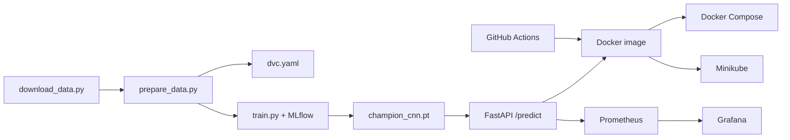

# Cats vs Dogs MLOps

End-to-end MLOps project for binary image classification (Cats vs Dogs) using a custom CNN. Includes data download/preprocessing, DVC pipeline stages, MLflow experiment tracking, FastAPI serving, Docker, Minikube deployment, Prometheus/Grafana monitoring, and GitHub Actions CI/CD.

## Prerequisites

- **Python 3.11**
- Docker (Docker Desktop or Colima) + Docker Compose
- Optional: `kubectl` + Minikube for Kubernetes deploy

```bash
brew install python@3.11 colima docker docker-compose
colima start --cpu 4 --memory 6
```

## Quick Start

```bash
cd image-classification-mlops
python3.11 -m venv .venv
source .venv/bin/activate
pip install --upgrade pip
pip install -r requirements.txt
pip install -e .

# 1. Download Microsoft Cats & Dogs archive (~800MB)
python scripts/download_data.py

# 2. Preprocess to 224x224 RGB + 80/10/10 split
python scripts/prepare_data.py
# Faster subset (optional):
# python scripts/prepare_data.py --max-per-class 1500

# 3. Train CNN + log to MLflow
python -m src.train

# 4. MLflow UI / API
./scripts/run_mlflow.sh   # http://127.0.0.1:5001
./scripts/run_api.sh      # http://127.0.0.1:8000/docs
```

> **Note:** Raw/processed images and `models/champion_cnn.pt` are not committed to git.
> Run download → prepare → train before local API or Docker builds.

On Windows use `python scripts/run_mlflow.py` and `python scripts/run_api.py` instead of the shell wrappers.

## Sample Prediction

```bash
curl -s -X POST http://127.0.0.1:8000/predict \
  -F "file=@/path/to/cat_or_dog.jpg;type=image/jpeg"
```

## Architecture



## Project Structure

```
image-classification-mlops/
├── src/                  # data, CNN, train, inference, API
├── scripts/              # download, prepare, deploy, smoke tests
├── tests/                # pytest suite
├── docker/               # Dockerfile + compose stack
├── k8s/                  # Minikube manifests
├── monitoring/           # Prometheus + Grafana
├── dvc.yaml              # prepare → train pipeline
├── .github/workflows/    # CI + CD
└── notebooks/            # exploratory notebook
```

## DVC

```bash
dvc repro          # runs prepare → train from dvc.yaml
dvc status
```

Local remote is configured under `.dvc/storage` (see `.dvc/config`).

## Docker

Train first so `models/champion_cnn.pt` exists, then:

```bash
python -m src.train
docker build -f docker/Dockerfile -t cats-dogs-api:latest .
docker run -p 8000:8000 cats-dogs-api:latest
./scripts/smoke_test.sh http://127.0.0.1:8000
```

Full stack (API + Prometheus + Grafana):

```bash
docker compose -f docker/docker-compose.yml up --build -d
# API:        http://localhost:8000
# Prometheus: http://localhost:9090
# Grafana:    http://localhost:3000  (admin/admin)
```

> MLflow UI stays local (`./scripts/run_mlflow.sh` → http://127.0.0.1:5001), not in Compose.

End-to-end local run:

```bash
chmod +x scripts/run_e2e.sh
./scripts/run_e2e.sh
```

Start the **full integrated stack** (Compose + MLflow):

```bash
./scripts/start_system.sh
# Stop: ./scripts/stop_system.sh
```

## Minikube Deployment

```bash
minikube start --driver=docker
eval $(minikube docker-env)
python -m src.train
docker build -f docker/Dockerfile -t cats-dogs-api:latest .
./scripts/deploy_k8s.sh
kubectl port-forward -n cats-dogs svc/cats-dogs-api 8002:8000
```

## Testing

```bash
pytest tests/ -v
ruff check src/ tests/
```

## CI/CD

GitHub Actions (`.github/workflows/ci.yml`):

1. **Lint** — ruff
2. **Test** — pytest
3. **Train smoke** — fast synthetic run; uploads model artifact
4. **Docker build + push** — container smoke test, push to GHCR

CD (`.github/workflows/cd.yml`) pulls the GHCR image and brings up Compose after CI passes on `main`.

## Monitoring

- Request logging in the FastAPI app
- Prometheus metrics at `GET /metrics`
- Grafana dashboard from `monitoring/grafana/`
- Post-deploy sampling: `python scripts/track_performance.py`

## Model

Custom **SimpleCNN** (4 conv blocks, 3→32→64→128→256 channels, FC head). Trained with Adam + cross-entropy; best checkpoint by validation accuracy saved to `models/champion_cnn.pt`.
